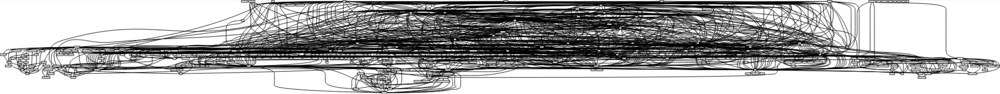

# Ethereum Software Supply Chain 

This repository contains the scripts and data of our analysis of the software supply chain of the Ethereum nodes Besu and Teku. If you use this data, please cite:

```bibtex
@article{ethereumSupplyChain,
 title = {The Multibillion Dollar Software Supply Chain of Ethereum},
 journal = {IEEE Computer},
 year = {2022},
 doi = {10.1109/MC.2022.3175542},
 author = {César Soto-Valero and Martin Monperrus and Benoit Baudry},
 url = {http://arxiv.org/pdf/2202.07029},
}
```

Repository structure:

- [bash_scripts](https://github.com/cesarsotovalero/ethereum-ssc/tree/main/bash_scripts): Scripts used to collect data about the software supply chain of Teku and Besu, inc. GitHub contributors, vulnerability analysis, dependency trees, Gradle tree of projects, cloc, etc.
- [docs](https://github.com/cesarsotovalero/ethereum-ssc/tree/main/docs): Public domain information about the Ethereum ecosystem.  
- [nodes_src](https://github.com/cesarsotovalero/ethereum-ssc/tree/main/nodes_src): Source code of Ethereum nodes cloned from the official repositories and used in our analysis.
- [python_notebooks](https://github.com/cesarsotovalero/ethereum-ssc/tree/main/python_notebooks): Python notebooks used for exploratory data analysis.
- [r_notebooks](https://github.com/cesarsotovalero/ethereum-ssc/tree/main/r_notebooks): R notebooks used for exploratory data analysis.
